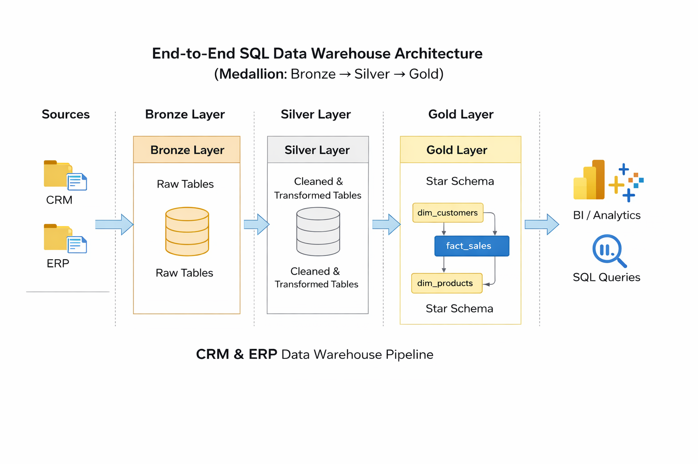
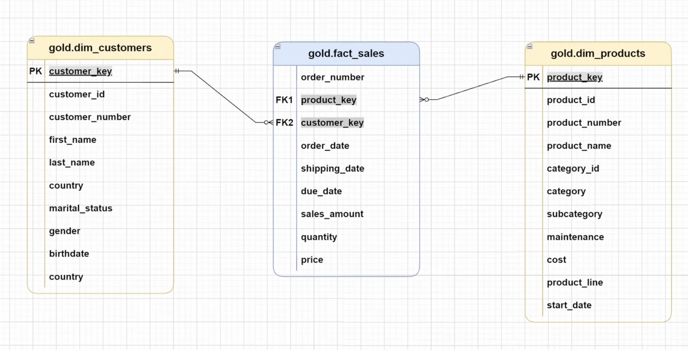

# End_To_End_Data_Warehouse_project
## Introduction  🚀
This project showcases the design and implementation of a modern Data Warehouse using SQL Server and Medallion Architecture (Bronze, Silver, Gold).
It covers data ingestion, cleaning, transformation, and dimensional modeling to create a scalable and analytics-ready data solution suitable for BI and reporting use cases.
#  🏗️ Project Architecture

1. **Bronze Layer**: Stores raw data as-is from the source systems. Data is ingested from CSV Files into SQL Server Database.
2. **Silver Layer**: This layer includes data cleansing, standardization, and normalization processes to prepare data for analysis.
3. **Gold Layer**: Houses business-ready data modeled into a star schema required for reporting and analytics.

## 📖 Dataset Used
[CRM_DATA](dataset/source_crm)

[ERP_DATA](dataset/source_erp)

The dataset includes CRM data (customers, products, and sales transactions) and ERP data (customer demographics, location, and product categories).
Key fields include customer_id, product_id, order_date, quantity, price, sales_amount, gender, birthdate, country, category, and subcategory, which are used for data integration, transformation, and star schema modeling in the warehouse.

##  📂 ETL
1. [Bronze_layer](Script/bronze_layer.sql) ---Creating and Loading the data
2. [silver_layer](Script/silver_layer.sql) ---Data cleaning/manuplating
3. [gold_layer](Script/gold_layer.sql)     ---Creating views for analysis

## ⭐ Star Schema Design
The Gold Layer uses a Star Schema design with a central fact table (fact_sales) connected to dimension tables (dim_customers and dim_products).
This structure enables efficient analytical queries, better performance, and simplified reporting for business insights.

